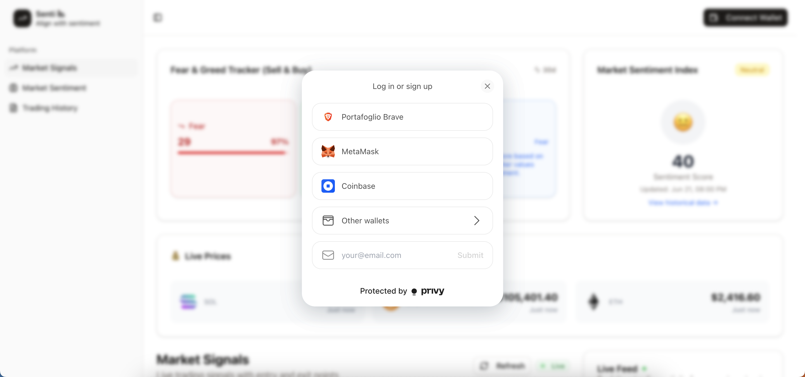
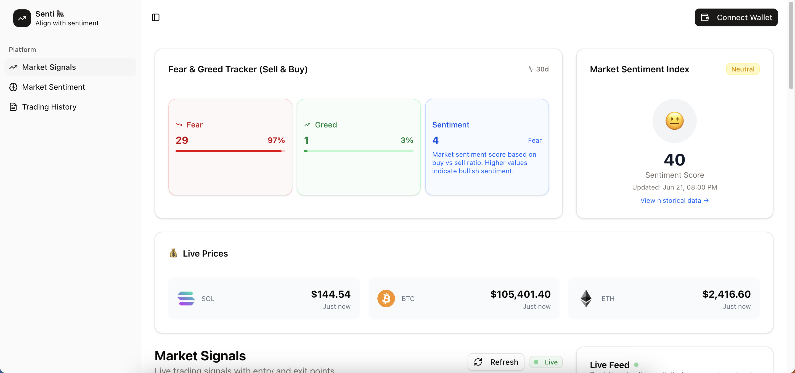
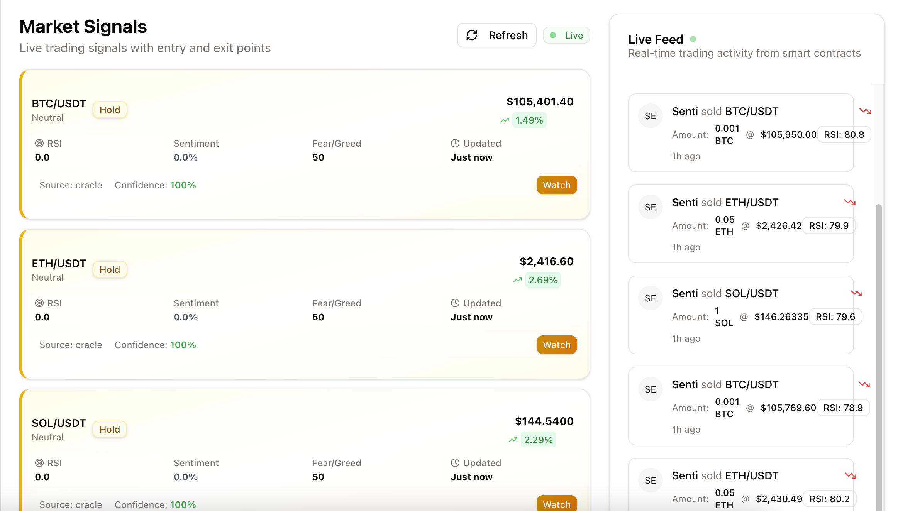
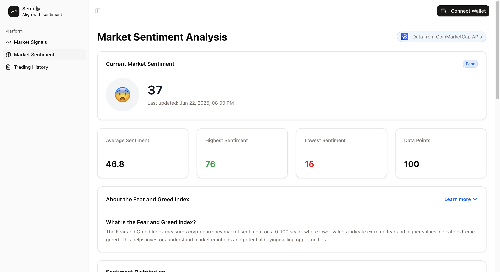
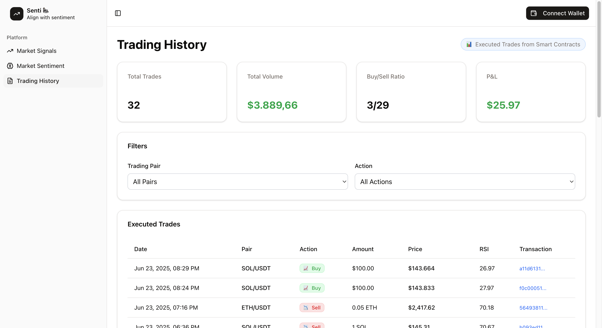

  

    <h1>Senti</h1>
  

  

    <strong>Automated trading based on market sentiment.</strong>
     
    <a href="https://senti-permissionless.vercel.app/" style="font-size: 16px"><strong>Visit the website »</strong></a>
     
    

    

    

    

    Powered by
    

        
        

    

  

      

# Table of contents

<!-- TOC -->
  - [1. Overview](#1-overview)
  - [2. Target audience](#2-target-audience)
  - [3. How to use Senti](#3-how-to-use-senti)
  - [4. Bounties](#4-bounties)
  - [5. Submission details](#5-submission-details)

## 1. Overview

Senti is an automated trading platform that helps users take advantage of the market through accurate and real-time indicators. It leverages the Supra oracle to fetch up-to-date price feeds from major cryptocurrencies and operates on the BNB Smart Chain Testnet. User trading activity is then aggregated to gauge market sentiment and further improve the accuracy of the signals.

## 2. Target audience

Senti is designed for crypto-native users who want to accelerate their trading activity by delegating part of their funds to an automated algorithm. This helps them eliminate impulsive behavior and trade only when selected indicators signal the right time to enter the market.

It also serves as a tool for information aggregation, providing an accurate picture of market sentiment by analyzing users' trading activity on the platform.

## 3. How to use Senti
<strong>1- Connect your wallet via Privy</strong> 

 
 
<strong>2- Check the current market sentiment based on users' activity</strong>

 
 
<strong>3- All the latest market signals are displayed in the homepage, together with price information and current users' trades.</strong>

 
 
<strong>4- The market sentiment section dives deep into the CMC Fear & Greed index, giving historical information on the index and displaying statistics regarding the crypto market.</strong> 

 
 
<strong>5- Users can see a complete list of all the trading actions in the Trading History page, as well as the total volume traded, buy/sell ratio, and other trading statistics.</strong> 

  
## 4. Bounties
- Supra:
  - <strong>On-Chain Automation Unleashed:</strong> Developed a signal generation algorithm that automates users' trading activity directly on-chain.

  - <strong>AI Agents + Supra: Smarter Contracts:</strong> Price feeds for BTC/USDT, ETH/USDT, and SOL/USDT are continuously fetched via the Supra oracle. Senti pulls data from the BNB Testnet Pull Contract (0x6Cd59830AAD978446e6cc7f6cc173aF7656Fb917) every minute. The raw data is then resampled to generate trading signals using the RSI indicator every 5 minutes.
  
- BNB:
  - <strong>AI:</strong> Senti acts as a Personalized Financial Advisor, guiding users through the market and maximizing their results. Our solution is unbiased and unaffected by human psychology, eliminating impulsive behavior and panic selling to enable users to trade at their best.

- <strong>Trojan Trading:</strong>
  - <strong>Microservice for Memecoin Trading Analytics:</strong> Senti analyzes the market to identify the best trading opportunities using real-time price feeds and a signal generator script based on the RSI indicator. The system is designed to be extensible, allowing unlimited integration of new indicators, unlocking the full potential of the signal generation engine for various use cases.

## 5. Submission details

- GitHub Repository: https://github.com/gorilli-team/senti
- Link to the project: [senti-permissionless.vercel.app](https://senti-permissionless.vercel.app/)